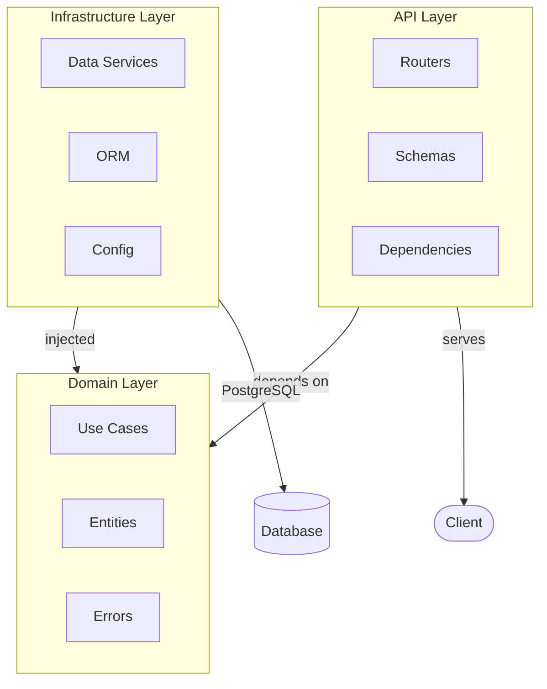
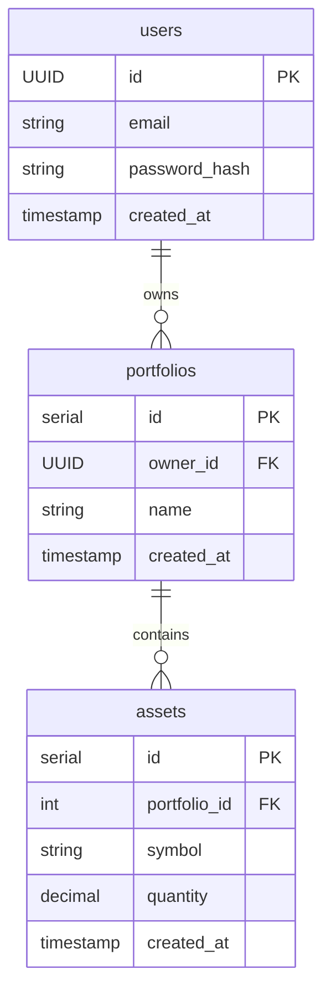
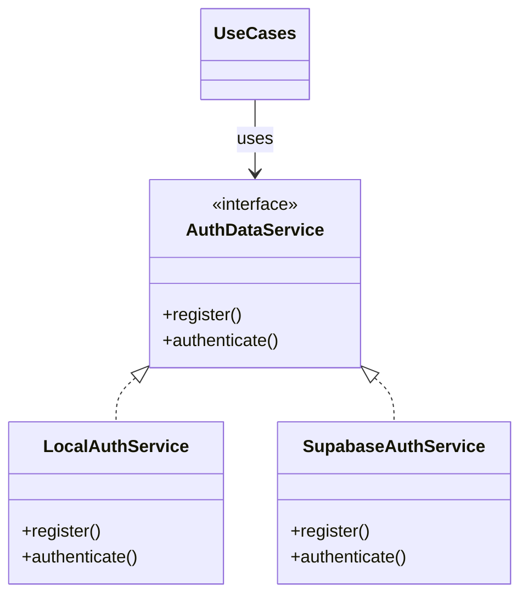
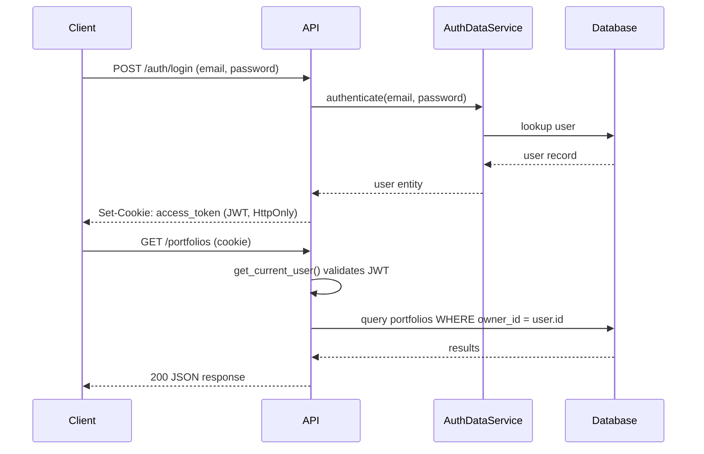
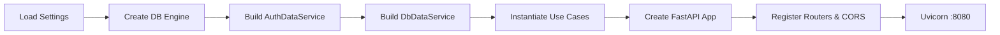

# Architecture

## Overview

Simple Portfolio Management is a full-stack application for managing investment portfolios. It follows **Clean Architecture** principles with **Domain-Driven Design (DDD)**, separating concerns across three layers: API, Domain, and Infrastructure.

## Tech Stack

| Layer          | Technology                                                  |
|----------------|-------------------------------------------------------------|
| Backend        | Python 3.12+, FastAPI, SQLAlchemy 2 (async), asyncpg        |
| Frontend       | Next.js (App Router), TypeScript, TanStack Query, shadcn/ui |
| Database       | PostgreSQL 14+                                               |
| Auth           | JWT (HS256) with Argon2 password hashing, optional Supabase  |
| Migrations     | golang-migrate (backend-agnostic SQL)                        |
| Infrastructure | Docker, Kubernetes (Helm), GitHub Actions                    |
| Quality        | pytest, ruff, bandit, SonarQube                              |

## Project Structure

```
├── backend/python/
│   └── src/
│       ├── api/rest/           # FastAPI routers, Pydantic schemas
│       ├── domain/             # Use cases, entities, exceptions
│       └── infrastructure/     # Config, data services, ORM models
├── database/
│   └── migrations/             # SQL up/down migration files
├── frontend/                   # Next.js TypeScript application
├── helm/                       # Kubernetes Helm charts
└── .github/workflows/          # CI/CD pipelines
```

## Layered Architecture



Dependencies flow inward: API depends on Domain, Infrastructure implements Domain interfaces. The Domain layer has no framework dependencies.

## Domain Model

### Aggregates and Entities

- **User** — `id (UUID)`, `email`, `created_at`
- **Portfolio** — `id (int)`, `owner_id (UUID)`, `name`, `created_at` — owns Assets
- **Asset** — `id (int)`, `portfolio_id`, `symbol`, `quantity`, `created_at`
- **PortfolioValuation** — computed value with price lines and unknown symbols

All domain entities are frozen dataclasses with slots, ensuring immutability.

### Entity Relationships



Cascade deletes: User → Portfolios → Assets.

## Design Patterns

### Repository Pattern

Abstract interfaces (`DbDataService`, `AuthDataService`) decouple data access from business logic. Implementations live in the infrastructure layer.

### Factory Pattern

`UseCases.build(settings)` constructs the full dependency graph at startup. `build_auth_dataservice()` selects the auth provider based on `AUTH_MODE`.

### Strategy Pattern



Auth providers (Local, Supabase) implement the same `AuthDataService` interface. The active provider is selected at configuration time and injected into use cases.

### Dependency Injection

FastAPI's `Depends()` system injects settings, use cases, and the current user into route handlers. Singleton instances are stored on `app.state`.

### Caching

Portfolio valuations use a TTL-based in-memory cache (`cachetools.TTLCache`, 30s TTL) with invalidation on asset mutations.

## Authentication & Authorization

### Authentication Flow



1. User registers/logs in via `/auth/register` or `/auth/login`
2. Server issues a JWT (HS256) stored in an HttpOnly cookie (`access_token`)
3. Subsequent requests include the cookie automatically
4. `get_current_user()` dependency validates the token and loads the user

### Authorization

- All portfolio/asset endpoints require authentication
- Resource-level scoping: queries filter by `owner_id == current_user.id`
- Portfolio ownership is verified before asset operations

### Security Measures

- Argon2 password hashing
- HttpOnly cookies (no JS access to tokens)
- Configurable `Secure`, `SameSite`, and `Domain` cookie attributes
- CORS origin allowlist

## API Endpoints

| Method   | Path                                      | Description              |
|----------|-------------------------------------------|--------------------------|
| POST     | `/auth/register`                          | Register user            |
| POST     | `/auth/login`                             | Login                    |
| POST     | `/auth/logout`                            | Logout                   |
| GET      | `/auth/me`                                | Current user             |
| POST     | `/portfolios`                             | Create portfolio         |
| GET      | `/portfolios`                             | List portfolios          |
| GET      | `/portfolios/{id}`                        | Get portfolio            |
| PATCH    | `/portfolios/{id}`                        | Update portfolio         |
| DELETE   | `/portfolios/{id}`                        | Delete portfolio         |
| GET      | `/portfolios/{id}/valuation`              | Portfolio valuation      |
| POST     | `/portfolios/{id}/assets`                 | Add asset                |
| GET      | `/portfolios/{id}/assets`                 | List assets              |
| DELETE   | `/portfolios/{id}/assets/{asset_id}`      | Delete asset             |
| GET      | `/prices`                                 | Current asset prices     |
| GET      | `/health`                                 | Health check             |

Paginated list endpoints return `{ items, pagination_response: { total_items, total_pages, current_page, items_per_page } }`.

## Configuration

Environment variables loaded via Pydantic Settings from `.env`:

| Variable             | Default                  | Description                          |
|----------------------|--------------------------|--------------------------------------|
| `APP_ENV`            | `dev`                    | Environment                          |
| `DB_HOST`            | `localhost`              | PostgreSQL host                      |
| `DB_PORT`            | `5432`                   | PostgreSQL port                      |
| `DB_NAME`            | `portfolio_db`           | Database name                        |
| `AUTH_MODE`          | `local`                  | Auth provider (`local` / `supabase`) |
| `JWT_SECRET`         | —                        | Required for local auth              |
| `JWT_EXPIRES_MINUTES`| `60`                     | Token lifetime                       |
| `CORS_ORIGINS`       | `http://localhost:3000`  | Allowed origins                      |
| `COOKIE_SECURE`      | `false`                  | Secure cookie flag                   |
| `COOKIE_SAMESITE`    | `lax`                    | SameSite policy                      |

## Startup Sequence



1. Load and validate settings from environment / `.env`
2. Initialize async SQLAlchemy engine with connection pool (10 + 20 overflow)
3. Build auth data service based on `AUTH_MODE`
4. Build database data service (SQLAlchemy)
5. Instantiate use cases (`AuthMgt`, `PortfolioMgt`) with data services
6. Create FastAPI app, register routers and CORS middleware
7. Uvicorn serves the app on port 8080

## Testing

- **Framework:** pytest with pytest-asyncio
- **Unit tests:** Use cases and settings validation with mocked data services
- **Integration tests:** REST API endpoints, auth providers, SQLAlchemy data service
- **CI:** GitHub Actions with PostgreSQL service container, ruff, bandit, coverage, SonarQube
- **Target coverage:** >80%

## Infrastructure

- **Docker:** Multi-stage build, health check via `/health` endpoint
- **Kubernetes:** Helm charts for deployment
- **Database migrations:** golang-migrate with versioned up/down SQL files
- **CI/CD:** GitHub Actions for lint, test, security scan, and build
